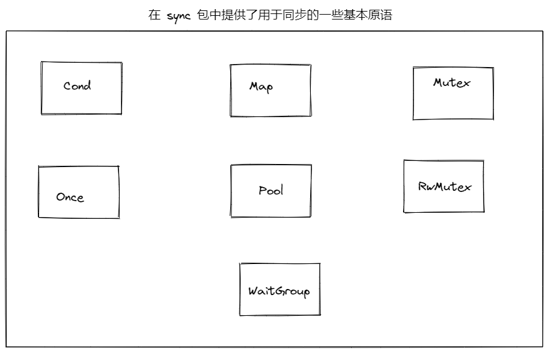

# go同步原语和锁

>Go 语言作为一个原生支持协程（Goroutine）的语言，当提到并发编程、多线程编程时，往往都离不开锁这一概念。锁是一种并发编程中的同步原语，它能保证多个 Goroutine 在访问同一片内存时不会出现竞争条件等问题。

Go语言在sync包中提供了用于同步的一些基本原语。



>在Go语言中推荐使用抽象更高的**Channel**实现同步

#### Mutex
Go 语言的 `sync.Mutex` 由两个字段 `state` 和 `sema` 组成。其中 `state` 表示当前互斥锁的状态，而 `sema` 是用于控制锁状态的信号量。

``` pf
type Mutex struct {
	state int32
	sema  uint32
}
```
上述两个加起来只占 8 字节空间的结构体表示了 Go 语言中的互斥锁。

>todo:下班后继续....